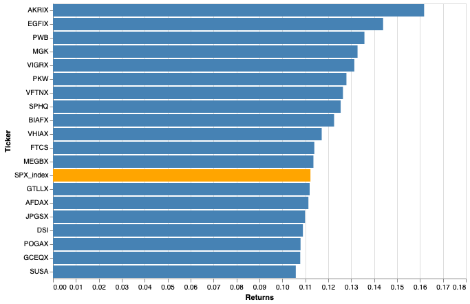
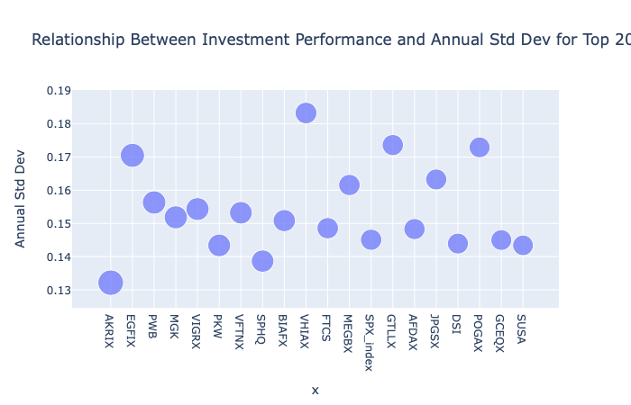
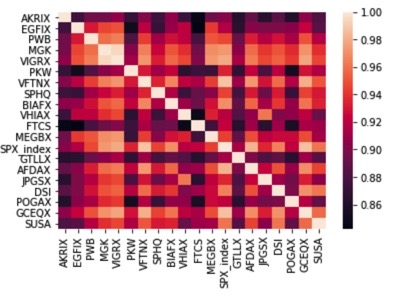

# Project-1-Fintech

# Sustainable Investing vs Index Fund Investing

## Team Members:
- David Still
- Anton Diez
- Akshay Jindal
- Moses Devanesan

# Topic of the Analysis:
Is there a price to be paid by investing in ESG mutual funds? How do mutual funds with high sustainability ratings perform against the S&P 500? 

# Hypothesis:
 Actively managed mutual funds tend to underperform passively managed or index funds on a regular basis. S&P Down Jones Indices released a report in 2019 and found that 85.1% of actively managed large-cap funds lagged the S&P 500 over a 10 year period:

   

Since sustainable funds need to be actively managed in order to select companies that meet certain criteria, our team surmised that at least 50% of the sustainable funds will underperform the S&P 500 over a 10 year period. 

If an investor feels that sustainable investing is important, how much will it cost them in returns? Will investors in sustainable funds have to deal with lower performance and higher volatility? 

# How We Performed the Analysis

Barron's provided a list of the large-cap mutual funds that received an "above average" or "high" sustainability rating from Morningstar. 

Taking this information from Barron's, our group compiled the daily closing prices from 2010-2020 from Bloomberg to see how these funds performed over a 10 year time period. To further our analysis, the group collected the ESG rankings and various value & growth measures (i.e. P/E ratio, risk rating) from Morningstar to better understand some of the characteristics of the sustainable funds. 

Altogether the team utlized 4 different data sets from Barron's, Morningstar and Bloomberg. This data was concatendated into one dataframe to do our analysis. 

# Data Cleanup & Exploration
The exploration process was challenging because we wanted access to data that typically required a paid subscription. Forttunately we were able to leverage colleagues and free trials to collect the necessary data. 

We first did the typical things one would do when they pull data from different sources. We removed extra columns that were not needed, dropped any rows that had null or missing values and renamed columns that had unnecessary or confusing symbols.  

The first issue that we needed to address was ensuring that we set the ticker symbols as index when we created the individual dataframes. If we did not do this, then we could not concatenate all the dataframes. This was not too challenging.

The biggest issue that we faced was that the dataframes would still not concatenate properly even after ensuring that indexes were the same. After several hours of trial and error, we eventually found that one of the CSV files contained spaces *before and after* the ticker symbol. Naturally, none of us considered that a well-known data provider would include unncessary spaces before and after the ticker symbols. Had we examined the CSV files more carefully we could have potentially caught this earlier.

# Data Analysis
Below are the questions we seeked to answer:
 
 1. Is there a price to be paid by investing in ESG mutual funds? How do mutual funds with high sustainability ratings perform against the S&P 500? 
 2. How the ESG ratings of the top sustainable funds compare to the S&P 500? 
 3. Within the top sustainable funds, what are the typical value and growth measures? 
 4. Within the top sustainable funds, what percentage are large value vs. large growth vs. large blend? 
 5. How correlated are the top sustainable funds? Did any the top funds happen to have a low correlation among any others? 
 6. How does the risk compare among the sustainable mutual funds as defined by Morningstar? 
 7. How is ESG defined? What does the E, S and G stand for? 
 8. Do the top sustainable funds have similar ESG scores? How much variation is there? How does Morningstar define these?

# Summarizing Major Findings

1. How do mutual funds with strong ESG investment policies compare to respective benchmark (i.e S&P 500)?

Out of 129 funds that we analyzed, the S&P 500 had the 13th highest annual return between 2010 and 2020 at 11.2%. 

2. What is the relationship between fund performance and standard deviation of the Top 20 Funds?

The best performing funds tended to have lower annual standard deviations while the lower performing fund had higher standard deviations. 

3. How did the Sharpe ratios show for the top 20 funds?

AKRIX had the highest sharpe ratio at 1.18. This fund’s rare combination of high returns and lower standard deviation set it apart from the others. The S&P 500 performed fairly well compared to the top 20 as well. It’s ranking was the 10th highest.  

3. What is the correlation between the Top 20 Funds?

The lowest correlation between the any two funds, AKRIX and SUSA, was 0.84. AKRIX was the best performing fund in the group while SUSA was worst performing, indicating less overlap among portfolio holdings. 

4. What is the comparison of EPS Growth, Returns, P/E Ratio for all Mutual Funds?

Projected EPS growth and P/E Forward are correlated. Akre Focus Fund, ticker symbol AKRIK, has a relatively high P/E Forward ratio and Projected EPS Growth. vPerformance is not necessarily driven by high multiples.

5. What are the various fund categories of the list of 128 mutual funds?

Large Blend, Large Value, Large Growth

6. What is the average risk rating for each fund category?

Majority of funds follow between Below Average and Average Risk (1.86)

7. How do E, S and G values compare to each other?

The Environmental metric of the ESG rating makes up a considerably smaller portion of the ESG rating, meaning that the funds have a lower rating in the Environmental category.The lower rating corresponds to lower risk, meaning that the E of ESG is the least risky out of all the metrics.

8. Of the funds that outperform the index, which of the sustainability metrics do the funds score highest in?

There is the least variation within the Governance category, and it also has the most outliers. The two higher rated metrics both have outliers, with the G having more above its range, and the S having all of its below its range

9. From the 3 metrics, how much variance is there between the metrics?

The most variation is within the Environmental category, however there are no outliers

10. Why is the risk in the Environmental metric much lower than the other ESG metrics?

Eighty percent of the world’s largest companies are reporting exposure to physical or market transition risks associated with climate change and a similar share are engaging in reducing corporate emissions. As Climate change continues, companies face more risk in the form of natural disaster that holds financial implications for infrastructure as well as property

# Discussion
Reiterating-out of 129 funds that we analyzed, the S&P 500 had the 13th highest annual return between 2010 and 2020 at 11.2%. The average return for the entire group was 6.9%. This would seem to indicate that there is a large opportunity cost for people investing in sustainable funds. 

Only 5 out of 20 top performing mutual funds actually have sustainable mandates. This means that investors do not need to explicity invest in mutual funds with sustainable mandates in order to acheive their desired goal.

S&P 500 index has comparable ESG ratings compared to the top 20 funds. Funds without sustainable mandates contain companies that have already begun implementing sustainable policies. 

Perhaps more surprisingly, the ESG score for the S&P 500 was similar to the ESG scores of the top performing mutual funds. Of the top 20 funds with the highest sustainability scores, only 5 of them had sustainability mandates. This would seem to indicate that some, if not many, of the components of the S&P 500 have already undertaken sustainability intiatives. 

# Interactive Investing Tool

# DATA

## Balance Sheet
###  Bloomberg, Quandl, Yahoo Finance, SEC EDGAR, MSCI

# Plotting
## Mapping (plotly express)
### Quantitative presentation (plotly, hvplot)

​

Sources:
  
  1.  https://www.cnbc.com/2019/03/15/active-fund-managers-trail-the-sp-500-for-the-ninth-year-in-a-row-in-triumph-for-indexing.html
  2. https://www.cnbc.com/2019/03/15/active-fund-managers-trail-the-sp-500-for-the-ninth-year-in-a-row-in-triumph-for-indexing.html
  3. https://www.morningstar.com/
  4. https://www.barrons.com/articles/top-esg-funds-our-annual-ranking-finds-sustainable-funds-are-increasingly-beating-the-market-51579301101

​